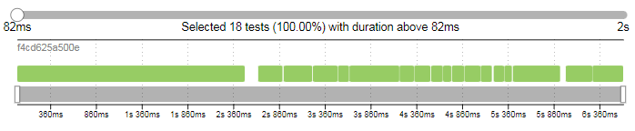
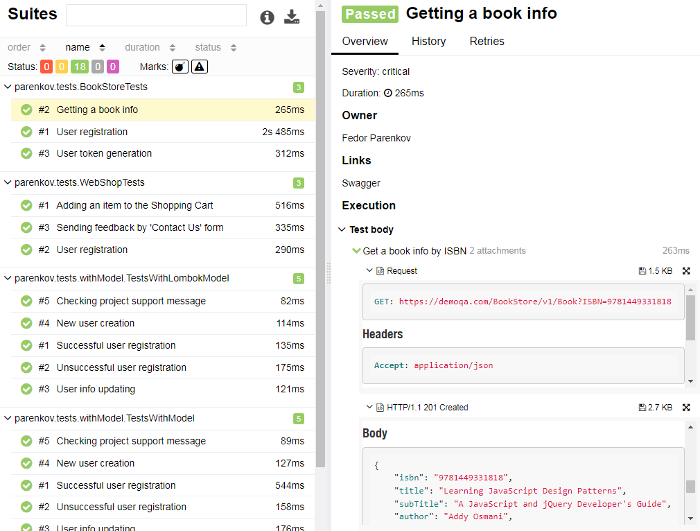
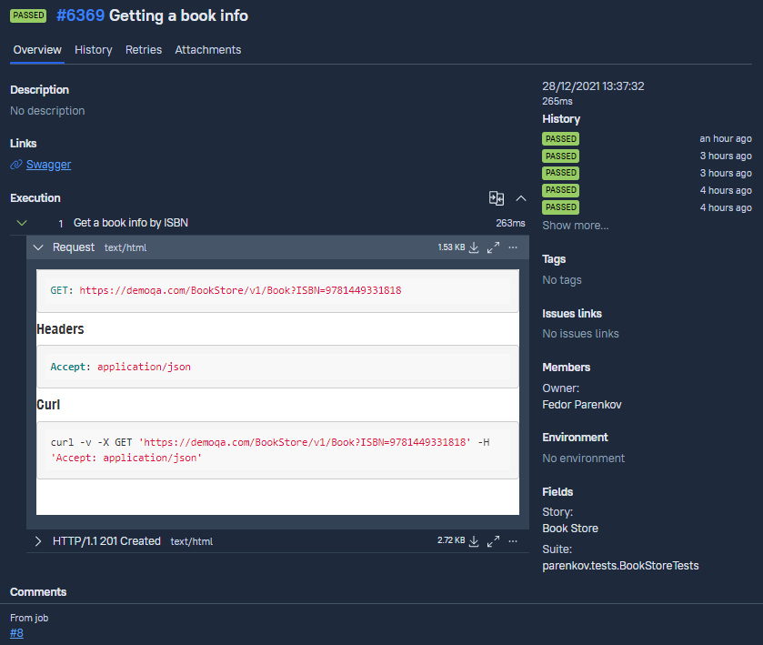

## Автоматизация тестов для REST API
В данном проекте представлен пример API автотестов на проверку функциональности сайтов [**Demo Web Shop**](http://demowebshop.tricentis.com), [**Book Store**](https://demoqa.com/books/), [**ReqRes.in**](https://reqres.in/).<br/>
### Тестируемая функциональность


**Reqres.in**
- Create new user;
- Update user info;
- Successful user registration;
- Unsuccessful user registration;
- Checking project support message;
- Find a user by name/surname.


**Book Store**
- User registration;
- User token generation;
- Getting a book info by ISBN.


**Demo Web Shop**
- User registration;
- Adding an item to the Shopping Cart;
- Sending feedback by 'Contact Us' form.

---
### Использованный технологический стек
 `Java` 
 `REST Assured` 
 `JUnit` 
 `Selenide` - написание исходного кода;<br/>
 `Gradle` - сборка проекта;<br/>
 `Jenkins` - конфигурация и запуск сборок;<br/>
 `Postman` - отправка тестовых запросов;<br/>
 `Allure Report` - формирование отчетности по итогам тестирования;<br/>
 `Allure TestOps` - создание тестовой документации;<br/>
 `Jira` - создание задачи в таск-трекере.<br/>


---
### Запуск тестов
Для запуска автотестов сконфигурирована :arrow_right: **[job](https://jenkins.autotests.cloud/job/08-WakeUpTheo-REST-Assured/)** :arrow_left: в CI Jenkins. В Jenkins job добавлена интеграция с Allure Report и Allure TestOps, а также настроена расслылка оповещений о результатах выполнения тестов в мессенджеры Slack и Telegram.<br/>

Команда для запуска тестов в консоли:
```
gradle clean test
```

---
### Результаты выполнения тестов

### Отчет в Allure Report







---
### Тестовая документация, сгенерированная в [Allure TestOps](https://allure.autotests.cloud/project/815/dashboards) по итогам прохождения тестов




---
### [Задача](https://jira.autotests.cloud/browse/HOMEWORK-295) в таск-трекере Jira с данными, экспортированными из Allure TestOps


---
### Оповещения о статусе сборки в мессенджерах
<br/>

---
<br/>

